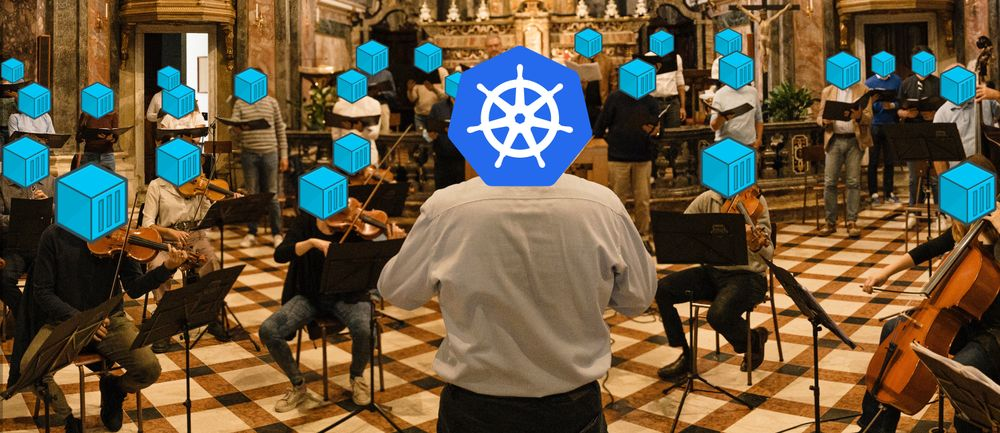

# Kubernetes intro

Imagine you have to deploy an application/service to a server. There are some problems/challenges you'll have to deal with:

- Setting up the application on the server (runtime engine, dependencies, versioning)

- Application's life cycle management (starting, updating and application crashing)

- Scaling (vertical vs. horizontal)

- Applications inter-communication (dns resolution)


## 1. Running the application manually

- You'll need to install the engine and dependencies manually. 'It works on my machine' problem.
    
    ```bash
    $ git checkout v1
    $ go get
    $ go run .
    $ curl localhost:8080/api/ping
    ```

- You'll start, update and handle any crash manually

    ```bash
    $ git checkout v2
    $ go get
    $ go run .
    $ curl localhost:8080/api/ping
    $ curl localhost:8080/api/pong
    ```

- **Vertical scaling** is straightforward. **Horizontal scaling** requires additional servers/resources  
    *how would you replicate the service?*  
    -> multiple instances?  
    -> similar to vertical scaling if we dont use more than one server
 
- You'll set up the services ips and domains manually. Using network tools like CIDR, iptables, firewalls and dns servers  
    *how could you assign a domain or ip to a single instance? what if this instance dies or it has to be replaced?*  
    -> you'll need to modify hosts file or setup/use a dns manually for internal and external comunnication. You're in charge of dealing with ips and domains assignation.

## 2. Running the application within containers

- No more need to install engines and dependencies manually. You'll only need the container runtime engine (docker)

    ```bash
    $ docker pull ghcr.io/antoine29/api:v1
    $ docker pull ghcr.io/antoine29/api:v2
    $ docker pull ghcr.io/antoine29/api:v3
    $ docker run -it --name api -p 8080:8080 ghcr.io/antoine29/api:v1
    $ curl http://localhost:8080/api/ping
    ```

- You still need to start, update and handle any crash manually. However, there are tools to support this (container orchestrators: compose, swarm)
    ```bash
    # update the service version
    $ docker stop api
    $ docker container rm api
    $ docker run -it --name api -p 8080:8080 ghcr.io/antoine29/api:v2
    $ curl http://localhost:8080/api/ping

    # crash the service
    $ curl http://localhost:8080/api/pong
    
    # replace the service
    $ docker container rm api 
    $ docker run -it --name api -p 8080:8080 ghcr.io/antoine29/api:v2
    # or restart the service
    $ docker restart api
    ```

- Horizontal scaling is now easier through containers replication
    ```bash
    $ docker run -d -p 8080:8080 ghcr.io/antoine29/api:v2
    $ docker run -d -p 8081:8080 ghcr.io/antoine29/api:v2
    $ docker run -d -p 8082:8080 ghcr.io/antoine29/api:v2
    $ curl http://localhost:8080/api/ping
    $ curl http://localhost:8081/api/ping
    $ curl http://localhost:8082/api/ping
    ```

- You're still on charge of setting up the services ips and domains manually. Container orchestrators (`docker-compose`) offers abstractions to deal with this

## 3. Introducing Kubernetes as a container orchestrator

- What is kubernetes

    formal definition: https://kubernetes.io/

    in few words, k8s is a containers orchestrator:

    

- kubernetes components:
    - master node and control plane
    - worker nodes
    - kubelet
    - kubectl
    - resources:
        - pods
        - deployments
        - services
        - jobs
        - ...

    more at: https://kubernetes.io/images/docs/components-of-kubernetes.svg

### Play with kubernetes

https://labs.play-with-k8s.com/

### Setting up

**copy: ctrl + insert**  

**paste: shift + insert**  

1. Create master instance/node

    ```shell
    $ kubeadm init --apiserver-advertise-address $(hostname -i) --pod-network-cidr 10.5.0.0/16
    ```

    **carefully copy the join command in the output!!**

    ```
    kubeadm join 192.168.0.8:6443 --token fvp7ns.0ug1sgitf49au3f4 \
    --discovery-token-ca-cert-hash sha256:dd2b1a08471dab7ae1e292c056e5ab9066972405a0a8d2d934e8e68c4cf042a7 
    ```

2. start cluster network 

    ```
    kubectl apply \
    -f https://raw.githubusercontent.com/cloudnativelabs/kube-router/master/daemonset/kubeadm-kuberouter.yaml
    ```

3. create and join a worker node : 

    Copy and run the command you got on step 1 output

### first deployment (imperative)

```shell
$ kubectl get po
$ kubectl run api --image=ghcr.io/antoine29/api:v1
$ kubectl get po
$ kubectl describe pod api
$ kubectl logs -f api
$ kubectl delete pod api
```


### first deployment (declarative)

```sh
$ curl -o deployment.yaml https://raw.githubusercontent.com/antoine29/k8s-intro/main/manifests/deployment.yaml
$ kubectl get deployments
$ kubectl apply -f deploy.yaml
```


### exposing the deployment through a service  

```sh
$ curl -o service.yaml https://raw.githubusercontent.com/antoine29/k8s-intro/main/manifests/service.yaml
$ curl localhost:30001/api/ping
```

why can't we just expose the pod?  
-> pods are ephimeral resources  
-> in case of a pod crash or deletion, the deployment will reconnect to the new pod

```sh
$ kubectl get po
NAME                   READY   STATUS    RESTARTS   AGE
api-86d7f5c76b-59mw2   1/1     Running   0          6m7s

$ kubectl delete pod api-86d7f5c76b-59mw2

$ kubectl get po
NAME                   READY   STATUS    RESTARTS   AGE
api-86d7f5c76b-xrg7n   1/1     Running   0          6s

$ curl localhost:30001/api/ping
```

## Scaling the application

> Show an example with k9s of the containers being created

```sh
$ sed -i 's/replicas: 1/replicas: 2/g' deploy.yaml 

$ kubectl delete deploy api
deployment.apps "api" deleted

$ kubectl apply -f deploy.yaml 
deployment.apps/api created

$ kubectl get po
NAME                   READY   STATUS    RESTARTS   AGE
api-5fc64877cf-hmhnr   1/1     Running   0          4s
api-5fc64877cf-tp2x7   1/1     Running   0          4s
api-5fc64877cf-wlkkv   1/1     Running   0          4s

$ curl localhost:30001/api/ping
{"message":"pong","code":200,"api_version":"v2"}$ 

$ curl localhost:30001/api/ping
{"message":"pong","code":200,"api_version":"v2"}$ 

$ curl localhost:30001/api/ping
{"message":"pong","code":200,"api_version":"v2"}$ curl localhos

$ curl localhost:30001/api/ping
{"message":"pong","code":200,"api_version":"v2"}$ 

$ kubectl logs api-5fc64877cf-hmhnr
2023/10/27 02:24:51 INFO Listening on: 8080 
2023/10/27 02:25:07 INFO ping received
2023/10/27 02:25:10 INFO ping received
2023/10/27 02:25:13 INFO ping received

$ kubectl logs api-5fc64877cf-tp2x7
2023/10/27 02:24:51 INFO Listening on: 8080 
2023/10/27 02:25:32 INFO ping received

$ kubectl logs api-5fc64877cf-wlkkv
2023/10/27 02:24:51 INFO Listening on: 8080 
```


## Updating the application

K8S uses a **Rolling updates** strategy to update the pods.  
This way, K8S updates the pods incrementally with zero downtime and trafic will be re-directed accordingly.

> Show an example with k9s of the pods being replaced

```sh
$ kubectl get po
NAME                   READY   STATUS    RESTARTS   AGE
api-86d7f5c76b-xrg7n   1/1     Running   0          6m41s

$ kubectl describe deploy api | grep Image
    Image:      ghcr.io/antoine29/api:v1

$ sed -i 's/api:v1/api:v2/g' deploy.yaml 

$ kubectl apply -f deploy.yaml 
deployment.apps/api configured

$ kubectl  get po
NAME                   READY   STATUS    RESTARTS   AGE
api-5fc64877cf-2p496   1/1     Running   0          18s

$ kubectl describe deploy api | grep Image
    Image:      ghcr.io/antoine29/api:v2

$ curl localhost:30001/api/ping
```


## Crashing the application

Notice that after the `/pong` call, the pod is restarted (and the logs are cleared)
```sh
# update to v2
$ kubectl get po
NAME                   READY   STATUS    RESTARTS      AGE
api-5fc64877cf-8dw6q   1/1     Running   2 (38m ago)   43m
$ kubectl logs api-5fc64877cf-8dw6q 
2023/10/27 03:08:25 INFO Listening on: 8080 
2023/10/27 03:45:35 INFO ping received
$ curl localhost:30001/api/pong
curl: (52) Empty reply from server
$ kubectl get po
NAME                   READY   STATUS    RESTARTS     AGE
api-5fc64877cf-8dw6q   1/1     Running   3 (5s ago)   44m
$ kubectl logs api-5fc64877cf-8dw6q 
2023/10/27 03:47:44 INFO Listening on: 8080 
```


## Application intercomunication (dns resolution)
take a alpine and make a curl to the service to show dns resolution


cat .kube/config | curl -F 'sprunge=<-' http://sprunge.us

curl -o config http://sprunge.us/Rff2Xe


docker run -d \
  -v /home/antoine/k8s-intro/manifests:/web \
  -p 8083:8080 \
  halverneus/static-file-server:latest

$ kubectl create service nodeport api --tcp=8080 --node-port=30001
